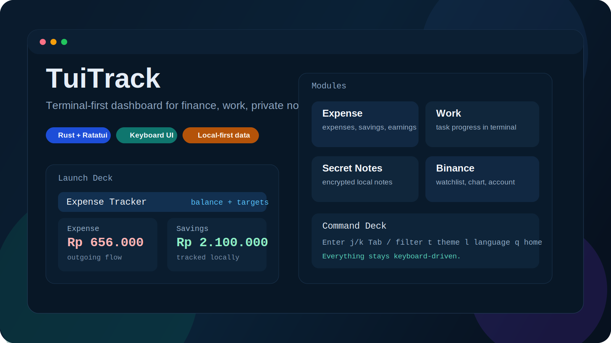
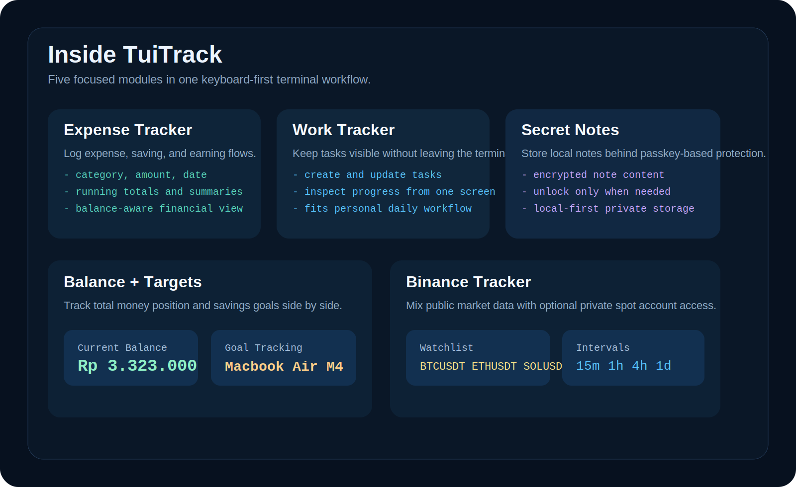

<p align="center">
  
</p>

<p align="center">
  
  
  
  
  
</p>

<p align="center">
  <strong>TuiTrack</strong> is a terminal-first personal dashboard for money tracking, work tracking,
  secret notes, and Binance monitoring in one Rust TUI.
</p>

<p align="center">
  <a href="#highlights">Highlights</a> •
  <a href="#tech-stack">Tech Stack</a> •
  <a href="#getting-started">Getting Started</a> •
  <a href="#keyboard-shortcuts">Keyboard Shortcuts</a>
</p>

## Why TuiTrack

TuiTrack is built for people who want a local-first tracker without leaving the terminal. Instead of splitting daily tracking across multiple apps, it puts expense management, savings goals, work progress, encrypted notes, and Binance market data into a single keyboard-driven workspace.

## Highlights

- Track expenses, savings, earnings, current balance, and financial targets from one interface
- Manage work tasks in the same app without switching tools
- Store secret notes locally in encrypted form
- Monitor Binance watchlist data, chart intervals, and spot account balances
- Switch theme and language directly inside the TUI
- Keep runtime data local with git-safe defaults for `.env` and `expenses.json`

## Preview

<p align="center">
  
</p>

## Modules

| Module | What it does |
| --- | --- |
| Expense Tracker | Record expenses, savings, earnings, categories, descriptions, and dates |
| Balance + Targets | Track current balance and define savings or total-balance goals |
| Work Tracker | Manage work items and progress directly from the terminal |
| Secret Notes | Save locked notes locally with passkey-based protection |
| Binance Tracker | Load live watchlist prices, interval-based chart data, and account snapshots |

## Tech Stack

| Layer | Tools |
| --- | --- |
| Language | Rust |
| Terminal UI | `ratatui`, `crossterm` |
| HTTP + API | `reqwest` |
| Serialization | `serde`, `serde_json` |
| Environment Loading | `dotenvy` |
| Security Utilities | `hmac`, `sha2`, `hex` |
| Date Handling | `chrono` |

## Getting Started

### Requirements

- Rust toolchain installed
- A terminal that supports alternate screen mode

### Run locally

```bash
cargo run
```

### Validate the build

```bash
cargo check
cargo fmt --check
```

## Environment Setup

Binance account features use a local `.env` file:

```env
BINANCE_API_KEY=your_api_key
BINANCE_API_SECRET=your_api_secret
```

Start from the provided template:

```bash
cp .env.example .env
```

If `.env` is missing, the app still runs. Public Binance market data remains available, but private account data will not be loaded.

## Data and Privacy

TuiTrack stores runtime data locally in:

```text
expenses.json
```

Repository safety defaults:

- `expenses.json` is ignored by git
- `.env` and `.env.*` are ignored by git
- `.env.example` is included as a safe public template
- If `expenses.json` does not exist, the app starts with empty data

## Keyboard Shortcuts

Common controls across the app:

- `Enter` to open modules or confirm actions
- Arrow keys and `j` / `k` to move through items and panels
- `Tab` and `Shift+Tab` to move focus in forms
- `/` to search or filter supported views
- `c` to clear active filters
- `t` to open theme selection
- `l` to open language selection
- `q` to return to the home screen

The app also shows live command hints in the footer.

## Project Structure

```text
src/
  app/        application actions and mutations
  state/      forms, navigation, and screen state
  ui/         ratatui render layers
  binance.rs  Binance data fetching and account handling
  storage.rs  local JSON persistence
```

## Notes

- This project is designed for local-first personal use
- Sensitive data should remain in local files, not version control
- For public sharing, keep `.env` and `expenses.json` private
